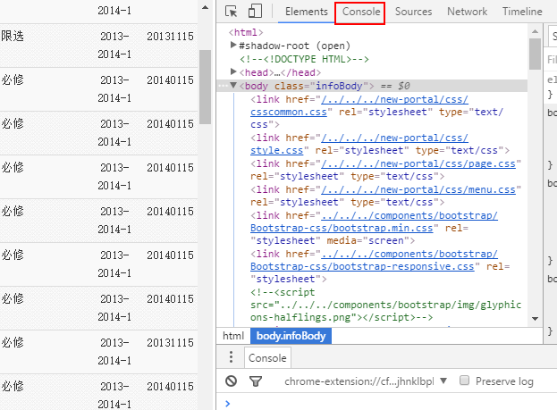

# Calculate GPA for Tsinghua
* These set of scripts can be used to calculate GPA.
* Star this repo if you like it~

# Step-by-Step Instruction
* Login in to [info](http://info.tsinghua.edu.cn/).
* Enter "全部成绩"

    
* Open "Developer tool". The short-cut for Chrome is <kbd>F12</kbd> (or <kbd>Fn</kbd>+<kbd>F12</kbd>). Then open "Console".

    

* Paste the code in gpa_*.js into the console, for example, the code below calculate overall GPA.
    ```
    var all_div = document.getElementsByTagName("td");
    function isInt(x) {
        var y = parseInt(x, 10);
        return !isNaN(y) && x == y && x.toString() == y.toString();
    }

    sum_credit = 0
    sum_score = 0

    for (i = 9; i < all_div.length - 11; i+=11) {
        if (!isInt(all_div[i+2].getElementsByTagName("div")[0].innerText)) {
            continue;
        }
        sum_credit += parseInt(all_div[i].getElementsByTagName("div")[0].innerText);
        sum_score += parseInt(all_div[i].getElementsByTagName("div")[0].innerText)
            *parseInt(all_div[i+2].getElementsByTagName("div")[0].innerText);
    }

    sum_score / sum_credit
    ```
* Then you will get your GPA!

# Functions
* **[gpa_overall.js](gpa_overall.js)** Calcualte overall GPA.
* **[gpa_required.js](gpa_required.js)** Calcualte GPA for Required (必修) and Restricted Elective (限选).
* **[gpa_last_two.js](gpa_last_two.js)** Cauculate GPA in the last two years.
* **[convert_to_4.js](convert_to_4.js)** An example to calculate 4 scale GPA.